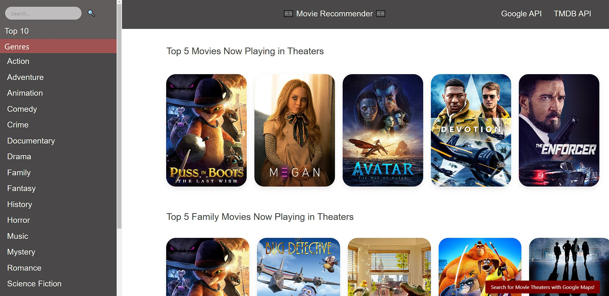

# Project 1: Movie Recommender

## ✏️ Description 
With this project, we wanted to create a user friendly website that would allow a user to view top rated movies, and filter genre types. The user can make a search, as well as use the given genre filters to help make an advised selection. Once a user finds a movie, they can then use the map modal in the bottom right corner, to search for nearby theaters!

## 📖 User Story

* AS A movie goer
* I WANT to know what top movies are out, and where to find them
* SO THAT I can find what to watch when I go to the theater

## 🖥️ Technologies Used

* JavaScript/HTML/CSS
* Bulma CSS Framework
* Google Map API
* TMDb API

## ⚙️ Installation

N/A

## 🌐 Deployed Application

The deployed application can be found at this link:
https://jsheen98.github.io/coding-bootcamp-project1-movie-recommender/

## 📸 Assets

The following images represent the website's appearance:

## 👥 Collaborators

* Devon Ethington
* Mason Aviano
* Daniel Jenkins
* Dukane Golder
* Jackson Sheen

## 📜 License

Please refer to the LICENSE in the repo